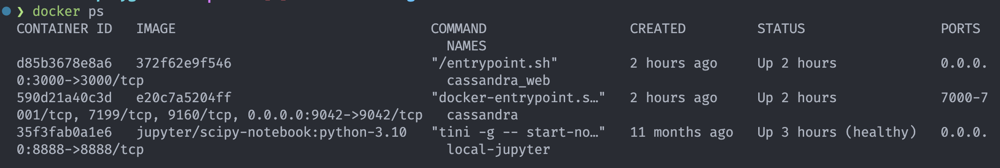
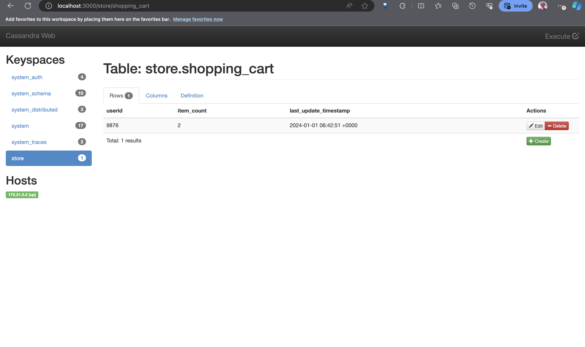
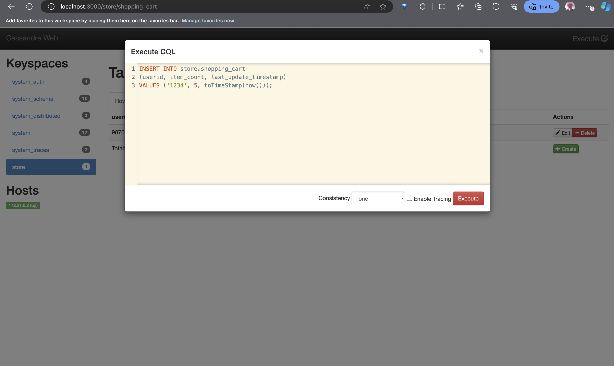
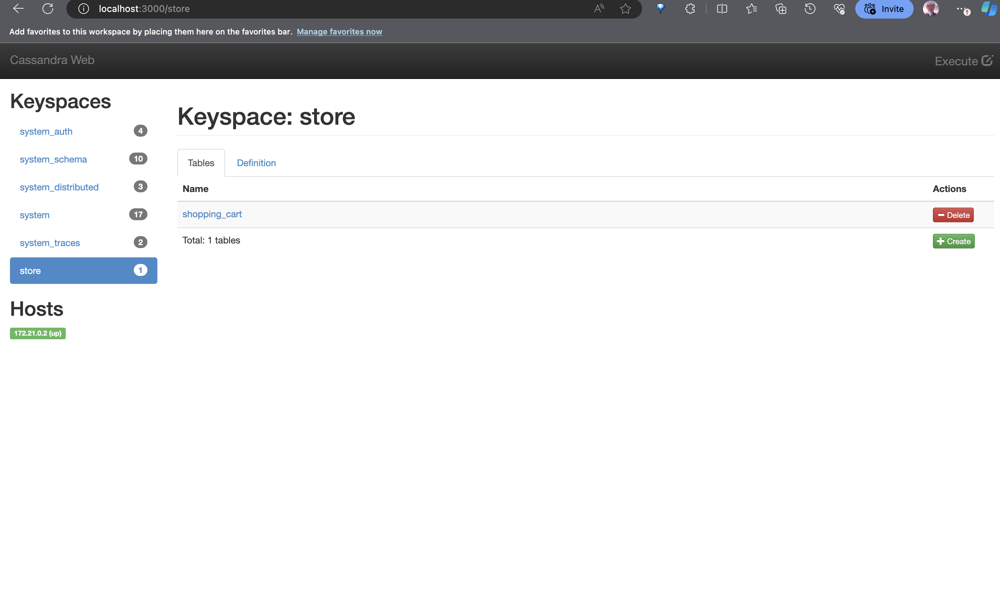

# Local Casandra Playground
Spin up your Cassandra cluster with UI Client in local less than 5 minutes with just one command!

## Prerequisites
1. Terraform. Install [here](https://developer.hashicorp.com/terraform/install)
2. Docker Engine. Install [here](https://docs.docker.com/engine/install/)

## Steps
1. Start the docker engine
2. Run `cd terraform` then `terraform init` to initialize the Terraform directory. This will create some folders and files used by Terraform to track your state and store your installed providers
3. Review your configurations with `terraform plan`
4. Then, finally run `terraform apply` to apply the config which will spin up defined containers alongside with pulling images beforehand
5. Then go to http://localhost:3000
6. To cleanup everything, run `terraform destroy`

## Tools
1. Cassandra Officials - `3.11`
2. Cassandra Web by delermando - `v0.4.0`

## Images

